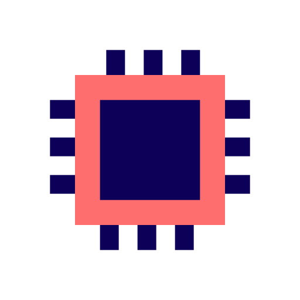

<h1> Chef A.I. - gerando receitas com inteligência artificial</h1>

Este projeto consiste em uma API desenvolvida com .Net, que recebe ingredientes dos usuários e gera receitas baseadas nos ingredientes recebidos usando uma inteligência artificial, e um site desenvolvido com ReactJS, que se permite aos usuários enviarem seus ingredientes e receberem as receitas geradas pela I.A.

<h2> Objetivo</h2>

Durante um curso de React, realizei um projeto bem semelhante a esse nas aulas. No entanto, o foco não era a I.A. em si, e sim sobre a biblioteca React. Por conta disso, fui atrás para estudar a como integrar modelos de inteligência artificial em .Net, que é a tecnologia principal utilizada neste sistema que desenvolvi.

Portanto, o foco deste projeto é aprender a integrar I.A. em sistemas usando o framework .Net.

<h2> Como funciona?</h2>
<h3> Backend</h3>
<h4> Dependencias<h4>

Na pasta Dependencias, defini uma classe responsável por configurar as dependências do projeto. Nesta classe, defini a I.A. para o sistema com o GitHub Models, onde coloco o modelo da I.A, a Uri para o modelo e o meu Token de acesso para ser autorizado quando a I.A. for utilizada.

Baixei a biblioteca Microsoft.Extensions.AI Para conseguir usar o serviços de Inteligência Artificial e Azure.AI.Inference para usar os modelos disponibilizados pelo GitHub.

Também configurei minha política CORS para quando meu site for fazer requisições à API, e um limite de requisições para não ficar sobrecarregando o servidor.

Por último, mas não menos importante, também defini o Scalar para ser a documentação API.

<h4> Repositórios<h4>

Nesta pasta, criei a interface <code>IChefAiRepositorio</code> para criar uma "assinatura" onde será necessário herdar o método <code>PegarReceita</code>.

A classe <code>ChefAiRepositorio</code> tem <code>IChatClient</code> inicializada em seu construtor para que possa usar a I.A. definida em <code>DependenciesConfig.cs</code>.

Para que a I.A. produza resultados esperados, que seria a geração de receitas, defini uma função para ela através da <code>string prompt</code>. Assim, terei a certeza de que o modelo irá ter um comportamento predefinido antes de receber as requisições dos usuários.

O método <code>PegarReceita</code>, antes de enviar a lista de ingredientes para a I.A., verifica se a lista possui pelo menos três ingredientes para que as respostas sejam consistentes e reduzir a chance de falha na geração de uma receita.

Depois que a lista é verificada, concateno a lista em uma string só e envio para a I.A. para que ela retorne uma receita para o usuário.

<h4> Models</h4>

Dentro dessa pasta, eu criei uma simples classe <code>ReceitaAi</code> que recebe uma lista de ingredientes.

Fiz isso para validar se a lista recebida está vazia e também para ficar mais explícito o que o endpoint na documentação da API está recebendo em seu corpo.

<h3> Frontend</h3>
<h4> Api.js</h4>

Este arquivo exporta o método <code>gerarReceita</code> para enviar os ingredientes para o a API e retornar a resposta para ser renderizada na tela.

O método <code>gerarReceita</code> realiza uma requisição <code>HTTP Post</code> usando o método <code>fetch</code> disponibilizado pelo Javascript com os seguintes parâmetros:

<ol>
    <li><code>method</code>: especifica qual método HTTP está sendo realizado.
        <ul><li>POST: especifica que dados estão sendo enviados para criar um novo objeto.</li></ul>
    </li>
    <li><code>headers</code>: especifica o cabeçalho da requisição.
        <ul><li><code>Content-Type: application/json</code>: especifica que o corpo da requisição tem o conteúdo do tipo <code>application/json</code></li></ul>
    </li>
    <li><code>mode</code>: se a requisição utiliza a política CORS ou não. Certas funções só podem ser realizadas se o modo CORS for escolhido.</li>
    <li><code>body</code>: é o corpo da requisição onde o conteúdo está sendo enviado para a API.
        <ul><li><code>ingredientes</code>: é o nome da propriedade que estará recebendo o vetor de ingredientes.</li></ul>
    </li>
</ol>

<h4> componentes</h4>

Nesta pasta, eu adiciono todos os componentes necessários para renderizar o conteúdo do site no documento HTML.

<h4><code>App.jsx</code></h4>

Este é o componente responsável por apenas renderizar outros componentes necessários para mostrar o conteúdo ao usuário. Dessa forma, tenho uma melhor organização dos componentes principais que estão sendo renderizados na página.

<h4><code>Header.jsx</code></h4>

Este componente, como indicado pelo nome, é responsável por renderizar o cabeçalho da página.

<h4><code>Lista.jsx</code></h4>

<code>Lista.jsx</code> renderiza a lista de ingredientes que o usuário possui enquanto ele adiciona novos ingredientes.

Esse componente recebe a lista de ingredientes como propriedade e itera pela lista inteira para criar um elemento <code>li</code> e apresentá-lo na página.

<h4><code>Receita.jsx</code></h4>

É aqui que a magia acontece. Bem, não é nada mágico, apenas uma simples decisão de renderização entre disponibilizar o botão de gerar uma receita, que chama o método <code>gerarReceita</code> que está sendo importado, apresentar uma tela de carregamento ao usuário quando sua receita estiver sendo gerada, e mostrar a receita trazida pelo backend.

Criei o estado <code>receita</code>, que é responsável por armazenar uma receita retornada pela API, e também criei o estado <code>carregar</code>, que é responsável por definir quando a tela de carregamento deve aparaecer ou não usando os dois valores booleanos (true e false)

Para permitir a requisição de uma nova receita e enviar os ingredientes adicionados, <code>Receita.jsx</code> recebe os ingredientes em suas propriedades e verifica se a lista possui pelo menos três ingredientes na lista e se uma requisição por esse mesmo usuário já não está sendo processada.

Portanto consigo evitar que usuário realize diversas requisições simultaneamente à API.

<h4><code>Main.jsx</code></h4>

Este componente é responsável por renderizar o corpo principal da página com um formulário que permite o usuário adicionar ingredientes para sua lista para depois gerar sua receita.

O estado <code>ingredientes</code> armazena a lista de ingredientes que são enviados como propriedades para os componentes <code>Lista.jsx</code> e <code>Receita.jsx</code>.

O método <code>adicionarIngrediente</code> recebe o ingrediente enviado pelo formulário e cria uma nova lista para atualizar o estado <code>ingredientes</code>.

O método <code>removerIngrediente</code> recebe o ingrediente através do botão que é criado junto o item da lista e cria uma nova lista sem o ingrediente que o usuário escolheu para atualizar o estado <code>ingredientes</code>. Dessa forma, usando o método <code>filter</code> para filtrar pela lista e criar uma nova sem o ingrediente a ser removido, evito mutar o state e causar problemas ao site.

<h2> Tecnologias utilizadas</h2>
<h3> Backend</h3>
<ul>
    <li><b>.Net</b>: framework utilizado para criar a API e desenvolver todo o backend;</li>
    <li><b>Scalar</b>: documentação API escolhida para apresentar a API de forma mais estilizada;</li>
    <li><b>Microsoft.Extensions.AI</b>: biblioteca usada para integrar modelos de inteligências artificiais ao sistema.</li>
</ul>

<h3> Frontend</h3>
<ul>
    <li><b>HTML</b>: linguagem de marcação de hipertexto usada para definir uma raiz da página;</li>
    <li><b>CSS</b>: linguagem de estilos em cascata usada para estilizar o site;</li>
    <li><b>JS</b>: utilizado para realizar requisições HTTP para a API, enviando os ingredientes e retornando a receita gerada;</li>
    <li><b>React</b>: biblioteca usada para renderizar os componentes apresentados na página de forma dinâmica para o usuário;</li>
    <li><b>React-Markdown</b>: biblioteca usada para estilizar a receita enviada pela I.A. de forma automática.</li>
</ul>
<h2>Demonstração</h2>
